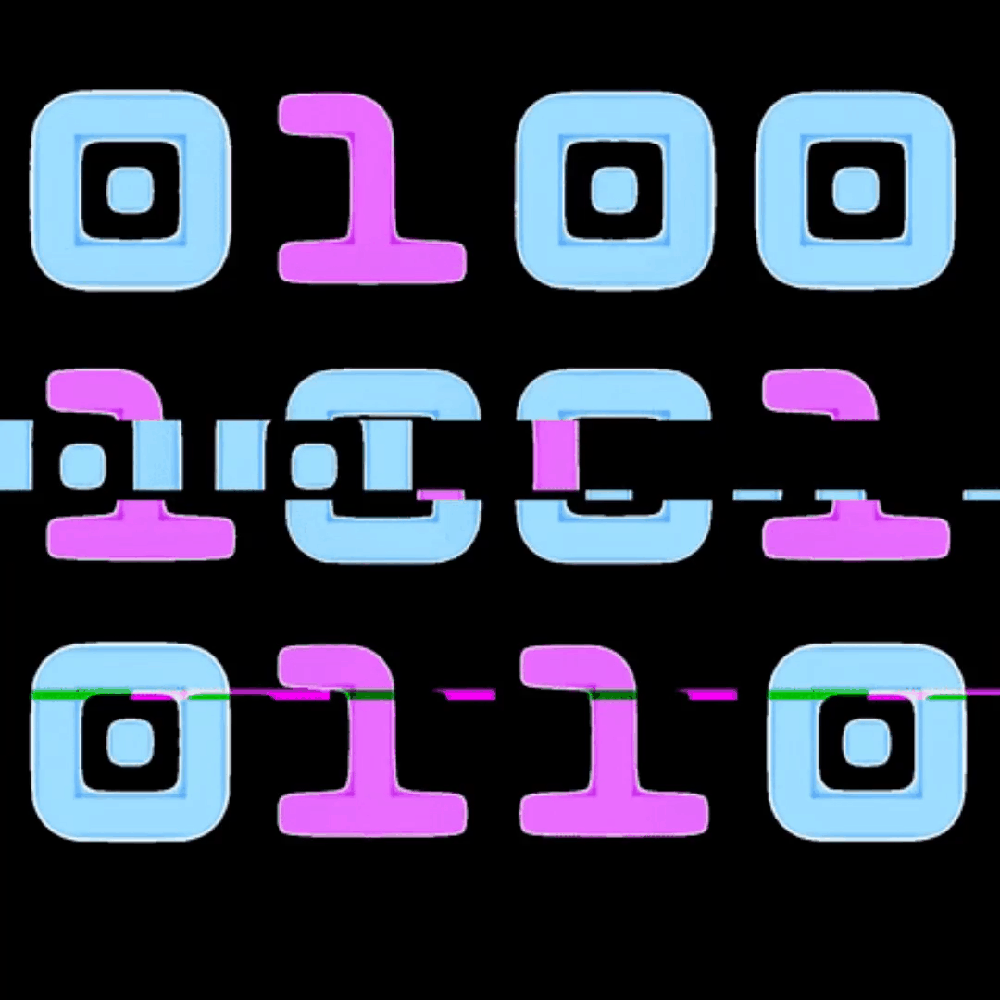

<h1 align="center">Hi , I'm Rolando Salinas</h1>
<h3 align="center">Passionate programmer for technology and software development. With over 10 years of experience in designing, implementing, and maintaining web and mobile applications. Specialized in programming languages such as Java, Python, and JavaScript, as well as in handling frameworks such as Spring and React Native. Always looking for new opportunities to continue growing professionally and adding value to innovative projects.</h3>

  

  

  
:zap: About me!

- 🔭 I’m currently working on [Sistema de Gestión de Reportes](https://github.com/rolycore/sst-api-reportes-fullstack-demo)

- 🌱 I’m currently learning **machine learning, IA**

- 👨‍💻 All of my projects are available at [https://app.netlify.com/teams/rolycore/sites](https://app.netlify.com/teams/rolycore/sites)

- 💬 Ask me about **React, Bootstrap, Angular**

- 📫 How to reach me **rolycore@gmail.com**
- 🌎 My web site [https://www.shalomsolutiontech.com](https://www.shalomsolutiontech.com)
 

 <h3 align="center">My software company</h3>
 

 
   

<h3 align="left">Connect with me:</h3>

<h3 align="center"> My Stacks and Skills</h3>
<h3 align="center"> </h3>
<h3 align="center">Languages and Tools:</h3>

                                                     

<h3 align="center"> GitHub Stats</h3>

&nbsp;

 <em align="center">!Thank you for visiting my GitHub profile!</em>
